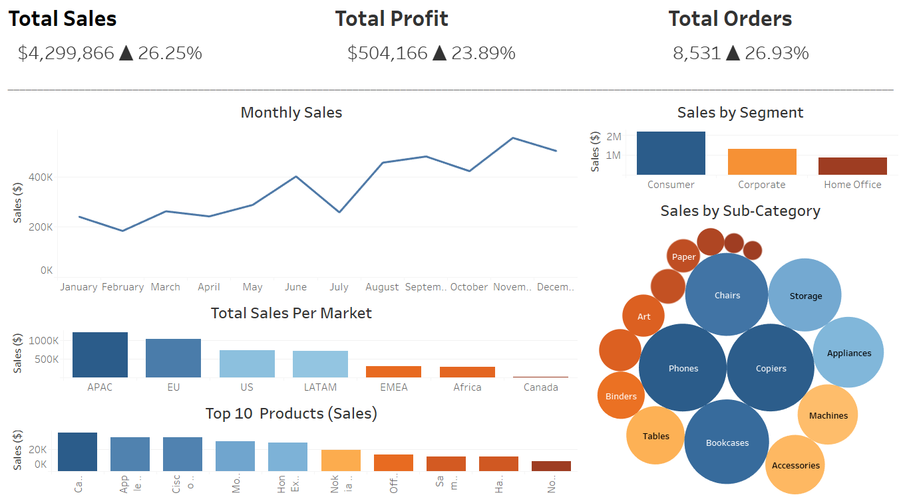
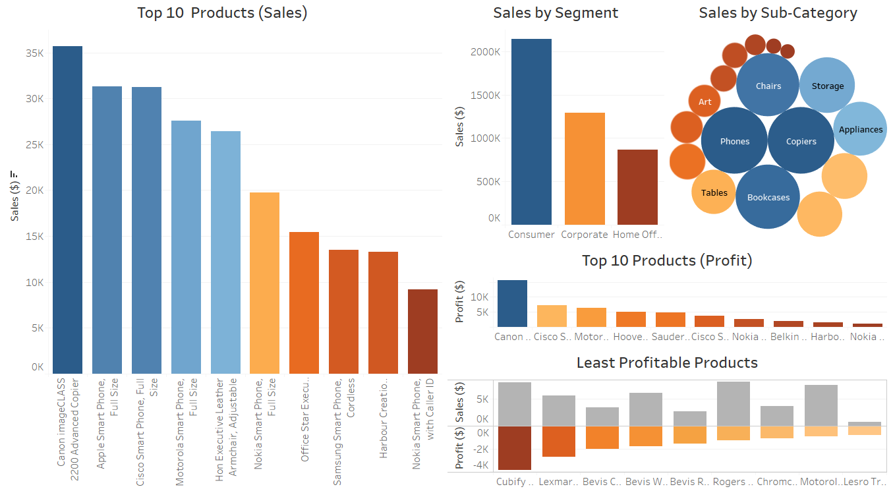
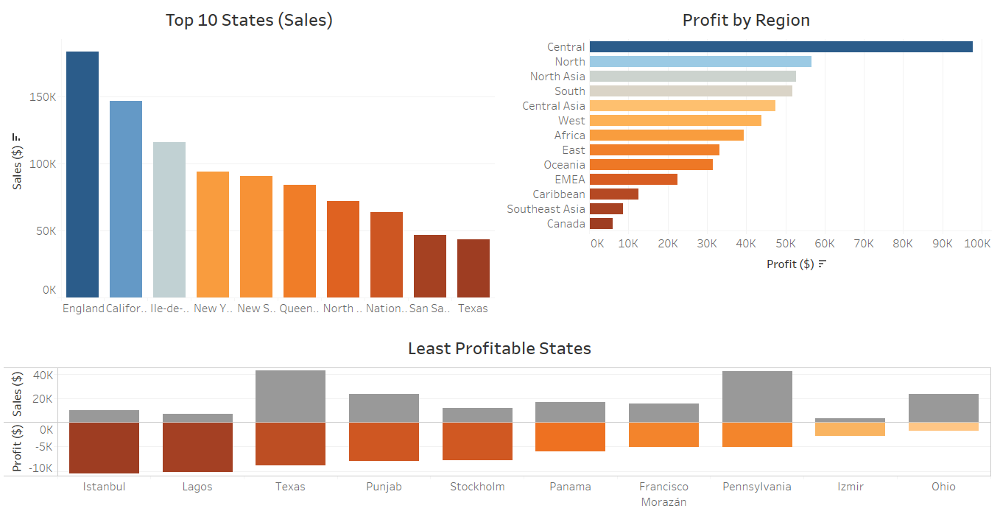

# Global Superstore Data (2014)

## Summary Dashboard

•	Total sales of $4,299,866 was made, which is a 26.25% increase from 2013.

•	A total profit of $504, 166 was made, which is a 23.89% increase from 2013.

•	There were a total of 8,531 orders which is a 26.93% increase from 2013.

•	November had the highest sales amount ($555,279).

•	Febraury had the lowest sales amount ($184,837).

•	In terms of the general sales trend for the year, sales were steadily increasing from January and sharply decreased in July and picked up again in August.

•	The APAC and EU market accounted for most of the sales, where as the Canadian market had the least sales.

•	The top 3 products in terms of sales were the Canon image CLASS 2200 Advanced Copier, Apple Smart Phone (Full Size) and Cisco Smart Phone (Full Size).

•	The consumer segment accounted for the majority of sales with just over $2 million in sales.

•	 The majority of sales were in the phones, copiers, bookcases, chairs, storage and applicances sub-categories.

## Product Dashboard

•	The top 3 products in terms of sales were the Canon image CLASS 2200 Advanced Copier, Apple Smart Phone (Full Size) and Cisco Smart Phone (Full Size).

• The consumer segment accounted for the majority of sales with just over $2 million in sales.

• The majority of sales were in the phones, copiers, bookcases, chairs, storage and applicances sub-categories.

• The top 3 most profitable products were the Canon image CLASS 2200 Advanced Copier, Cisco Smart Phone (Full Size) and Motorola Samrt Phone (Full Size).

• The Cubify CubeX 3D Printer Triple Head Print was the least profitable product and had a total profit loss of $3,840. This product was followed by the Lexmark MX611dhe Monochrome Laser Printer and Bevis Computer Table (Fully Assembled).

## Geography Dashboard

• England, California and Ile-de-France were the states that accounted for most of the sales.

• The Central region was the most profitable region ($97,724) which was followed by the North region ($56,658) and North Asia ($52,770).

• Istanbul was the least profitable state which generated a total profit loss of $10,386. However, Lagos generated a total profit loss of $10,129 which a total sales amount of only 6,626.

## Dataset
Data Source: https://www.kaggle.com/apoorvaappz/global-super-store-dataset

**Order ID:** Identifies each unique order.

**Order Date:** Date the order was places.

**Ship Date:** Date the order was shipped.

**Ship Mode:** Shipping mode of the order (e.g. standard class).

**Customer ID:** Identifies each customer. 

**Customer Name:** Name of the customer.

**Segment:** Segment of the product being purchased (e.g consumer).

**City:** City from which the order was placed.

**State:** State from which the order was placed.

**Country:** Country from which the order was placed.

**Postal Code:** Postal code of the order.

**Market:** Market that the order is based in.

**Region:** Region from which the order was placed.

**Product ID:** Identifies each product.

**Category:** Category of the product (e.g. technology).

**Sub-Category:** Sub-Category of the product (e.g. sub-category of technology is phones).

**Product Name:** Name of the product.

**Sales:** Sales value of the order.

**Quantity:** Quantity ordered of the product.

**Discount:** States the discount amount that was applied (if any was applied).

**Profit:** Profit from the order.

**Shipping Cost:** Cost of shipping the order.

**Order Priority:** Identifies the priority of the order (e.g Medium priority).

